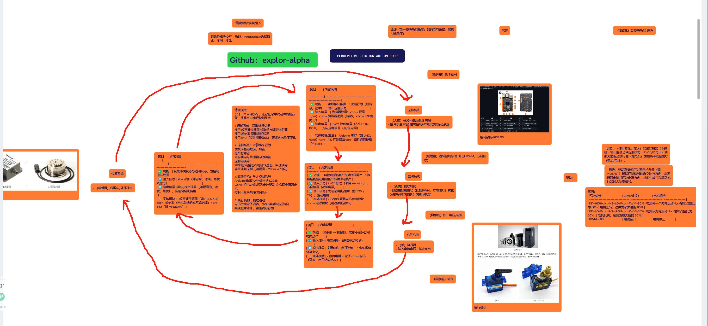
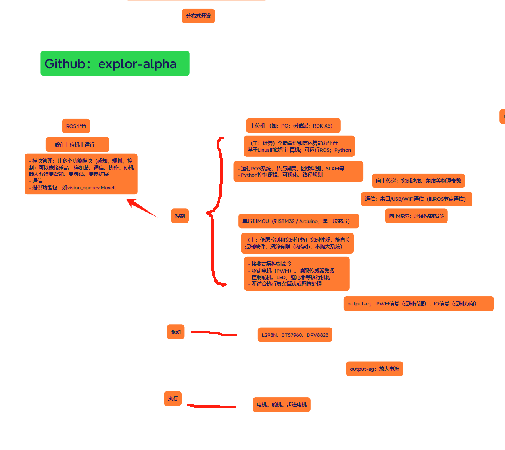

# Notes-Embodied-AI
Datawhale开源教程笔记 &amp; 我对Embodied AI体系的建立

### 参考
> [!NOTE] 参考
> 1. Datawhale项目链接
> [https://github.com/datawhalechina/ai-hardware-robotics/blob/main/README.md](https://github.com/datawhalechina/ai-hardware-robotics/blob/main/README.md)

> 3. Lumina具身智能社区
> [https://github.com/TianxingChen/Embodied-AI-Guide/blob/main/README.md](https://github.com/TianxingChen/Embodied-AI-Guide/blob/main/README.md)

### 说明：
-  [notes_D1](notes_D1) ：我对理论知识的理解
	- 这些是我学习初期的想法，**很可能有误**
	- 我希望在这一部分为可以用极为精简的语言描述清楚功能/原理/实现方式等等
-  [notes_D2](notes_D2) ：理论知识的记录
	- 这一部分可以说是项目相关理论知识的一个库吧
	- 这一部分我只是把相关理论知识过了一遍，旨**尽可能快**得知道**有这么一个东西及其作用**，关键词加粗或高亮
-  [pdf_notes_D1](pdf_notes_D1) ：由于格式转化问题（Obsidian是“双等号“标记高亮但GitHub好像不是...格式问题我先不管了）我把note_D1转成pdf，或许会更清晰些。

---
---

# 1. Embodied AI知识体系(宏观理解)：

### 1.1 Embodied AI整体框架

> **暂时还不完善，可能有部分部分不准确，欢迎指出**

> 机器人架构梳理/数据流

  

> 分布式开发

  

### 1.2. Embodied AI任务落地方式（建立简单任务如何落地的大概整体框架）：

> 五种范式在具身智能任务落地的对比（“红杯子进微波炉”）

| 范式       | 感知       | 理解              | 决策方式            | 控制方式          | 泛化能力 | 动态适应 | 训练成本       |
| -------- | -------- | --------------- | --------------- | ------------- | ---- | ---- | ---------- |
| Pipeline | 模块化感知    | 显式任务分解          | 路径规划+动作图谱       | PID / MoveIt  | 中    | 弱    | 中          |
| 模仿学习     | 端到端视觉+状态 | 无语言理解           | 模仿轨迹            | PID           | 弱~中  | 弱    | 低~中        |
| 强化学习     | 视觉+状态    | 奖励建模            | RL策略学习          | RL输出 + PID    | 中    | ✅ 强  | 🚨 高       |
| VLA      | 多模态融合    | Transformer语言理解 | Transformer动作预测 | PID + 动作接口    | ✅ 强  | 中    | 🚨🚨 很高    |
| VLA + RL | 多模态融合    | 语言分解 + 任务选择     | RL执行子策略         | PID + RL策略控制器 | ✅ 强  | ✅ 强  | 🚨🚨🚨 非常高 |

# 2. (细致化)组件-关键词：

- 手眼标定——视觉感知和下位机控制模块——校准高精度标定-“相机看到的坐标系”&“机器人坐标系”的固定转换关系——如果是完全端到端 joint-control（例如 image → joint angle），有时不显式使用；

- RDK X5开发板——控制系统-硬件基础（集成上位机和下位机功能）
- 机器人学习（VLA，RL，模仿学习，pipline模块化控制等等范式）——控制系统-上位机（高层/决策层）——“决定做什么”
- PID——控制系统-下位机（控制层）——“控制怎么做”；根据传感器反馈的物理量（如位移）来控制效应器（如升力）以使被控制物的（位移）稳定趋于期望值——基于规则；稳定

- 深度估计与3D重建？
- sam？

# 3. PS&疑问：

1. notes_D1文件夹中内容的理解可能有偏差，需要后续实践阶段证明

2. PID是基于规则的而不是基于学习的？PID在后续算法中充当什么作用？
> ChatGPT：
> - 作为低层控制器嵌入高级系统：无人机轨迹跟踪-轨迹由高层路径规划生成，**姿态和高度**由底层 PID 跟踪
> - **Baseline**：在训练自动平衡的智能体时，先用 PID 保证不摔倒，再让 RL 学习超越 PID 性能
> - 混合控制：深度学习辅助 PID-用深度网络预测扰动或系统响应，再由 PID 做**补偿**
> - 在不确定性强的环境中作为“鲁棒 fallback”机制：PID 是最可靠的“安全兜底机制”，始终保持最基本的控制**稳定**性

---
---

# 4. 具身研究可能能用到的工具：
- LLM as General Planner——API编写

  

  

