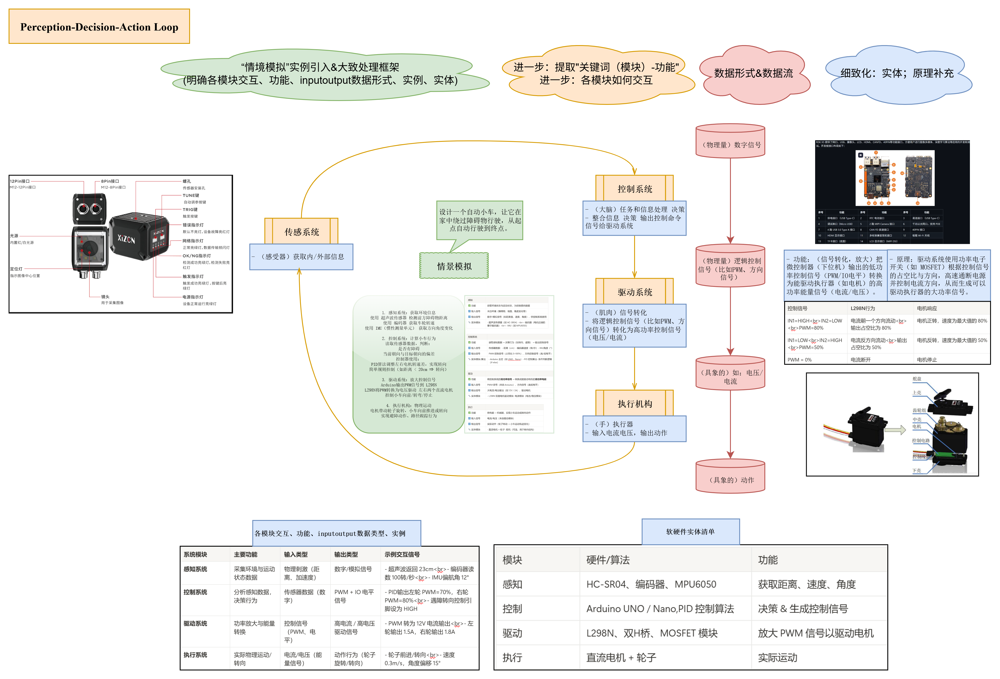
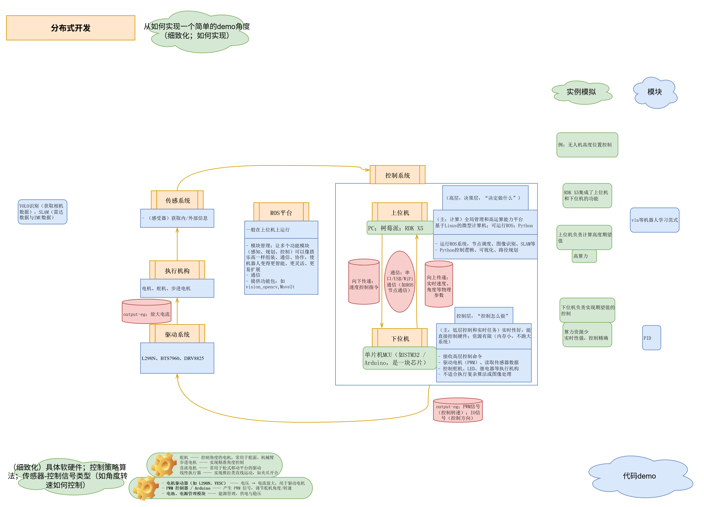

# Notes-Embodied-AI
Datawhale开源教程笔记 &amp; Embodied AI体系的建立 &amp; 2025.7.15入门Embodied AI，故有些理解可能不太准确，欢迎issue &amp; 持续更新中

### 资源：
> 主要参考资料：
> 1. 整体框架的理解，简单demo的实现——Datawhale开源组织
> [https://github.com/datawhalechina/ai-hardware-robotics/blob/main/README.md](https://github.com/datawhalechina/ai-hardware-robotics/blob/main/README.md)
> 2. 整体框架的理解，较为完善的知识库——Lumina具身智能社区
> https://github.com/TianxingChen/Embodied-AI-Guide/blob/main/README.md
> 3. 更多是应用落地层面——宇树具身智能社群
> [https://www.unifolm.com](https://www.unifolm.com)
> 4. NVIDIA Isaac Sim
> - [腾讯云-IsaacSim 4.5(1)-环境配置](https://mp.weixin.qq.com/s/Cknba3d9sLJZjEgZCna_zg)
> - [腾讯云-IsaacSim 4.5(2)-导入与模拟LeRobot手臂](https://mp.weixin.qq.com/s/Pr9_C29tLWhM03dVjkdcHQ)
> - [腾讯云-Sim/LeRobot机械臂(视频)](https://cloud.tencent.com/developer/video/83311)
> - [Sim环境下已经安装ROS2但ROS 2 OmniGraphs不可选择问题](https://cloud.tencent.com/developer/video/83321)

### 说明：
- 1_README.md：整体体系的建立&引导性说明
	- 关键词/组件-功能
	- 串联关建词；建立宏观”体系“（此时不追求精确和完美，更关注完整性，对整体有大致理解就可以结束了）
	- 实践落地&论文阅读（此时可以对上述”体系“进行验证和深入理解）==（doing）==
	- 了解行业发展动态&主流范式（时刻记住我的最终导向是工业界，如何实现功能落地）
	- 补充一些工具
- 1_实践文件夹：
	- 论文阅读——先是发展综述，再是范式，再是功能、创新点
		- VLA范式——VIMA==（todo）==
	- 对”2_notes_D1文件夹“的实践——”独立模块demo“
		- 手眼标定、PID等等==（todo）==
	- NVIDIA Isaac 机器人平台生态
		- Isaac Sim实现仿真环境下的机械臂控制
		- Isaac训练RL==（todo）==

- 2_notes_D1文件夹：理论知识的理解
	- 旨在尽可能：清晰的思路；精简地表达功能/原理/实现方式
- 2_notes_D1_pdf文件夹：notes_D1的pdf（由于部分高亮的等格式GitHub显示不出）

- 3_notes_D2文件夹：相关理论知识的“库”和储存
	- 这一部分我只是把相关理论知识过了一遍
	- 旨在**尽可能快**的知道**有这么一个东西及其作用**，关键词加粗或高亮

---
---

# 1. Embodied AI知识体系(宏观理解)：

### 1.1 Embodied AI整体框架/架构

#### “具身”？

> 这部分或许属于嵌入式-ai机器人领域？——主要解决在一个**资源受限但要求实时性强的环境中**，**完成智能任务并能在物理世界中执行动作**（是具身智能的“具身”？）

> 以下部分旨在对具身实现建立一个大致的概念
> 虽说有部分专业名词以及理解可能不够准确，但不是此时的重点，后续理解更深入时，我会重新修改

  

  

#### “智能”——VLA等几个方法范式——对应上述框架中的上位机模块？

---
---

# 2. (细致化)组件-关键词：

- **RDK X5开发板**——控制系统-硬件基础（集成上位机和下位机功能）

控制-上位机：
- **NVIDIA Isaac 机器人平台生态-GR00T**——控制系统上位机，高层任务规划——LLM
- **NVIDIA Isaac 机器人平台生态-Isaac Lab**——控制系统上位机，中层决策控制——RL
- 机器人学习的几个方法范式（**VLA**，RL，模仿学习，pipline模块化控制等等范式）——控制系统-上位机（高层/决策层）——“决定做什么”

控制-下位机：
- **NVIDIA Isaac 机器人平台生态-Isaac Sim**——“虚拟”下位机+驱动+执行
- **手眼标定**——视觉感知和下位机控制模块——校准高精度标定-“相机看到的坐标系”&“机器人坐标系”的固定转换关系——如果是完全端到端 joint-control（例如 image → joint angle），有时不显式使用；
- **PID**——控制系统-下位机（控制层）——“控制怎么做”；根据传感器反馈的物理量（如位移）来控制效应器（如升力）以使被控制物的（位移）稳定趋于期望值——基于规则；稳定

其他：
- 深度估计与3D重建？
- sam？

---
---

# 3. 如何实现简单demo落地：

  

  

---
---

# 4. 行业动态和研究前沿

---
---

# 5. 具身研究可能能用到的工具：
- LLM as General Planner——API编写

  

  

---
---
# 5. PS&疑问：

1. notes_D1文件夹中内容的理解可能有偏差，需要后续实践阶段证明

2. PID是基于规则的而不是基于学习的？PID在后续算法中充当什么作用？
> ChatGPT：
> - 作为低层控制器嵌入高级系统：无人机轨迹跟踪-轨迹由高层路径规划生成，**姿态和高度**由底层 PID 跟踪
> - **Baseline**：在训练自动平衡的智能体时，先用 PID 保证不摔倒，再让 RL 学习超越 PID 性能
> - 混合控制：深度学习辅助 PID-用深度网络预测扰动或系统响应，再由 PID 做**补偿**
> - 在不确定性强的环境中作为“鲁棒 fallback”机制：PID 是最可靠的“安全兜底机制”，始终保持最基本的控制**稳定**性

